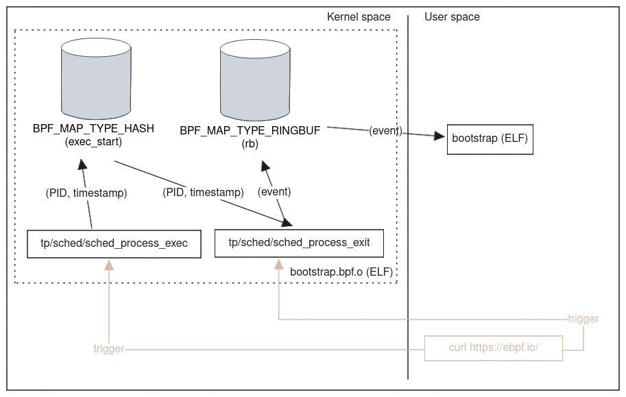

# bpf-c-template

A GitHub template repository with the scaffolding for a BPF application
developed with [libbpf/libbpf] and BPF [CO-RE]. The loader is written in C and
leverages the skeleton generated with the [libbpf/bpftool] command.
BPF programs are written in C and compiled to BPF bytecode with [LLVM] and
[Clang].

A sample BPF code is the Bootstrap application introduced by the
[libbpf/libbpf-bootstrap] project. It tracks process starts and exits and emits
data about filename, PID and parent PID, as well as exit status of the process life.

``` console
$ sudo ./bootstrap 
TIME     EVENT COMM             PID     PPID    FILENAME/EXIT CODE
09:57:38 EXEC  ip               18165   18164   /usr/sbin/ip
09:57:38 EXEC  cut              18166   18164   /usr/bin/cut
09:57:38 EXEC  head             18167   18164   /usr/bin/head
09:57:38 EXIT  ip               18165   18164   [0] (1ms)
09:57:38 EXIT  cut              18166   18164   [0] (1ms)
09:57:38 EXIT  head             18167   18164   [0] (1ms)
```

``` console
$ ./bootstrap --help
Usage: bootstrap [OPTION...]
BPF bootstrap demo application.

It traces process start and exits and shows associated
information (filename, process duration, PID and PPID, etc).

USAGE: ./bootstrap [-d <min-duration-ms>] [-v]

  -d, --duration=DURATION-MS Minimum process duration (ms) to report
  -v, --verbose              Verbose debug output
  -?, --help                 Give this help list
      --usage                Give a short usage message
  -V, --version              Print program version

Mandatory or optional arguments to long options are also mandatory or optional
for any corresponding short options.

Report bugs to <pacak.daniel@gmail.com>.
```



This template repository contains also the [Release](.github/workflows/release.yaml)
workflow to relase a new version of the `bootstrap.tar.gz` archive whenever a
new version of the Bootstrap application is released.

To build and run the Bootstrap application on macOS you can use Lima and the
[bpf-c-template.yaml](bpf-c-template.yaml) virtual machine template. Lima
launches Linux virtual machines with automatic file sharing and port
forwarding (similar to WSL2).

```
brew install lima
```

```
git clone --recurse-submodules git@github.com:danielpacak/bpf-c-template.git
cd bpf-c-template
```

or

```
git clone git@github.com:danielpacak/bpf-c-template.git
cd bpf-c-template
git submodule update --init --recursive
```

```
limactl create --name=bpf-c-template bpf-c-template.yaml
limactl start bpf-c-template
limactl shell bpf-c-template
```

```
dpacak@lima-bpf-c-template:/Users/dpacak/go/src/github.com/danielpacak/bpf-c-template$ make
dpacak@lima-bpf-c-template:/Users/dpacak/go/src/github.com/danielpacak/bpf-c-template$ sudo ./bootstrap
TIME     EVENT COMM             PID     PPID    FILENAME/EXIT CODE
09:41:27 EXEC  ls               6071    6054    /usr/bin/ls
09:41:27 EXIT  ls               6071    6054    [0] (3ms)
```

[libbpf/libbpf]: https://github.com/libbpf/libbpf/
[libbpf/bpftool]: https://github.com/libbpf/bpftool/
[libbpf/libbpf-bootstrap]: https://github.com/libbpf/libbpf-bootstrap/
[CO-RE]: https://nakryiko.com/posts/bpf-portability-and-co-re/
[LLVM]: https://llvm.org/
[Clang]: https://clang.llvm.org/
[Lima]: https://lima-vm.io/
